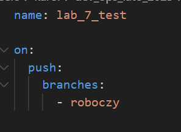
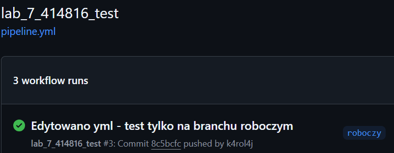
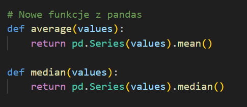
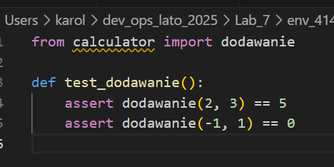
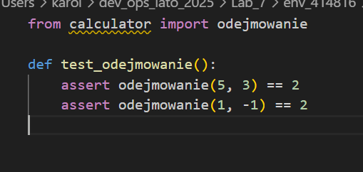
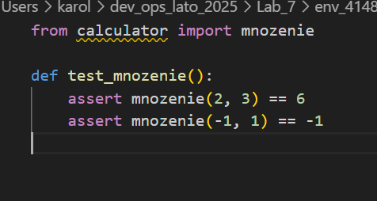
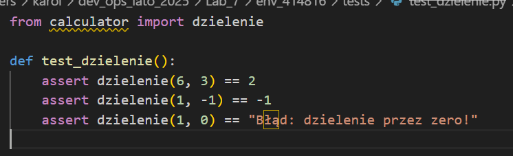
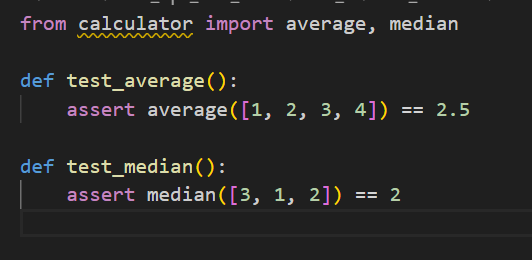
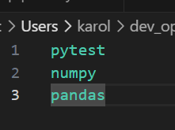
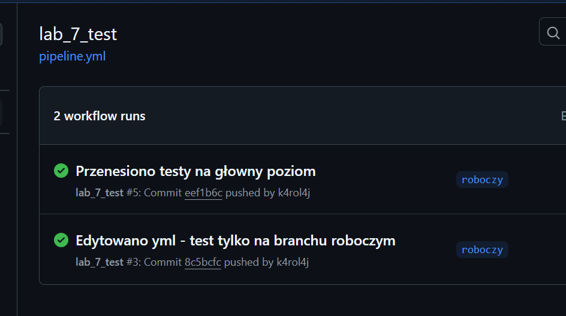

*Karolina Jędryczka - 414816, gr. 3*  

# Sprawozdanie - lab. 6 
Celem laboratoriów jest zapoznanie się z narzędziem git actions i zbudowanie własnego flow.

## Przebieg zajęć:
### 1. Zaktualizowanie repo.

```bash
git fetch --all

git checkout main

git pull 
```

### 2. Stworzenie własnego repozytorium.
Przekopiowanie zawartości folderu env_00000 do env_414816 

Stworzenie brancha roboczego na własnym repo za pomocą `git checkout -b roboczy`:

### 3. Przerobienie sktyptu pipeline.yml.
Zmiana w pliku pipeline.yml aby test uruchamiał się tylko na branchu roboczym:



Tworzymy commita i sprawdzamy wynik testu:



Test wykonał się pozytywnie.

### 4. Przerobienie kodu.
Dodanie nowych funkcji korzystających z biblioteki pandas lub sympy:


Utworzenie testów do nowych funkcji:







Dodanie bibliotek do requirements.txt:



W celu przetestowania każdej funkcji osobno, plik pipeline.yml został rozbudowany o pięć niezależnych jobów. Cztery z nich odpowiadają za testy podstawowych operacji matematycznych (dodawanie, odejmowanie, mnożenie, dzielenie), uruchamiając testy z odpowiednich plików.

Dodatkowo, został dodany job new_test, który uruchamia testy dla nowo dodanych funkcji statystycznych: average i median. Testy te znajdują się w pliku test_statystyka.py.

Job new_test jest skonfigurowany tak, aby wykonał się dopiero po zakończeniu wszystkich czterech poprzednich jobów – mechanizm ten zrealizowano za pomocą słowa kluczowego needs.

Fragment pliku pipeline.yml:

``` bash

new_test:
    runs-on: ubuntu-latest
    needs: [test_dodawanie, test_odejmowanie, test_mnozenie, test_dzielenie]
    steps:
      - uses: actions/checkout@v2
      - uses: actions/setup-python@v4
        with:
          python-version: '3.11'
      - run: |
          pip install -r requirements.txt
          pytest test_statystyka.py

``` 

Dzięki zastosowaniu needs, mamy pewność, że testy nowych funkcji zostaną uruchomione dopiero wtedy, gdy wszystkie podstawowe funkcje będą poprawnie działały:

``` bash
needs: [test_dodawanie, test_odejmowanie, test_mnozenie, test_dzielenie]
```

Testy:


Wszystkie wyniki testów są poprawne.

### 5. Tematy do rozwinięcia.
**Po co są używane stages?**  
Stage pozwalają logicznie podzielić pipeline na odrębne kroki, np.: budowanie, testowanie, analiza, wdrażanie. Dzięki temu łatwiej zarządzać kolejnością, uzależniać wykonanie jednych działań od innych, a także równolegle uruchamiać niezależne części.
Przykład: można wykonać testy tylko, jeśli etap budowania zakończy się sukcesem.

**Jak można zmiejszyć liczbę własnoręcznie pisanych kroków w jobie?**  
Można skorzystać z gotowych akcji z GitHub Marketplace, które zawierają wcześniej przygotowane procedury.
``` bash
- name: Set up Docker Buildx
  uses: docker/setup-buildx-action@v2
```
To zastępuje kilka linijek kodu shellowego i zapewnia niezawodne, zaktualizowane środowisko buildowe Dockera.
Marketplace zawiera tysiące takich gotowych akcji do np. testów, instalacji środowisk, logowania do chmur, itp.

**Co to są artefakty w pipelinie i do czego służą?**  
Artefakty to pliki, które powstają w trakcie działania pipeline’u i są przechowywane po jego zakończeniu. Służą do:
- przekazania wyników z jednego joba do innego,
- pobrania logów, raportów testów, binarek, screenów z testów UI itp.,
- archiwizacji rezultatów.

Przykład w GitHub Action:
``` bash
- name: Upload artifact
  uses: actions/upload-artifact@v3
  with:
    name: test-results
    path: results/
``` 
**Jakie są inne narzędzia do wykonywania pipelinów testowych?**  
- GitLab CI/CD – zintegrowany system do budowania, testowania i wdrażania projektów w GitLab.
- CircleCI – elastyczny system CI/CD w chmurze lub self-hosted, popularny w projektach SaaS.
- Jenkins – jedno z najstarszych i najbardziej konfigurowalnych narzędzi CI/CD, z ogromną ilością pluginów.

Inne popularne: Travis CI, TeamCity, Azure Pipelines.

**Do czego w pipelinie może służyć sonar qube?**  
SonarQube to narzędzie do analizy statycznej kodu – może być zintegrowane z pipeline’em, by:

- sprawdzać jakość i bezpieczeństwo kodu,
- wykrywać błędy, tzw. "code smells", luki bezpieczeństwa, nadmiarową złożoność,
- wymuszać dobre praktyki programistyczne.

W pipeline SonarQube zwykle dodaje się jako osobny krok po buildzie, np.:
``` bash
- name: Run SonarQube Scan
  uses: SonarSource/sonarcloud-github-action@v2
  with:
    args: >
      -Dsonar.projectKey=my_project
```

Dzięki temu mamy automatyczną kontrolę jakości kodu przy każdym pushu lub PR.